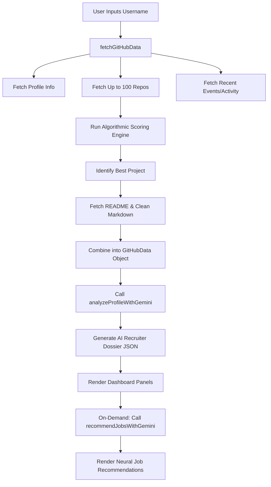

# GitAnalyze 🚀 // Neural Network GitHub Profiler

**GitAnalyze** is a premium, cyberpunk-themed developer analytics dashboard that connects directly to the GitHub REST API and leverages the **Google Gemini AI** cognitive synthesizer to analyze repositories, calculate codebase complexity scores, profile developer styles, and offer on-demand career matchmaking recommendations.

---

## 🛠️ Technology Stack

* **Frontend Framework**: [React 19](https://react.dev/) + [Vite](https://vite.dev/) (fast hot module reloading)
* **Language**: [TypeScript](https://www.typescriptlang.org/) (strict type-safe data interfaces)
* **Styling**: [Tailwind CSS v4](https://tailwindcss.com/) (cyberpunk dark-mode styling, neon glows, glassmorphism, animations)
* **Linter**: [Oxlint](https://oxc.rs/docs/guide/usage/linter) (fast Rust-based static code analysis)
* **AI Cognitive Engine**: [Google Gemini 3.1 Flash Lite API](https://ai.google.dev/) (structured JSON outputs)
* **Data Source**: [GitHub REST API v3](https://docs.github.com/en/rest)

---

## ⚡ Application Workflow

The application operates in a structured data pipeline to profile any user:



1. **GitHub Profiler Fetch (`githubApi.ts`)**:
   - Fetches the developer's public profile data (bio, followers, location, repository count).
   - Fetches up to 100 repositories.
2. **Algorithmic Quality Scoring**:
   - Original (non-fork) repositories are run through a local heuristic scoring formula:
     $$\text{Score} = (\text{Stars} \times 3) + (\text{Forks} \times 2) + \text{README}(10) + \text{Language}(5) + \text{Recency}(10) + \text{Description}(5) + \text{Topics}(2 \times N)$$
3. **Best Project Deep Analysis**:
   - The top rated project's full README is downloaded, base64-decoded, and stripped of markdown formatting (tables, images, badge links, headers) to conserve API input token counts.
4. **AI Cognitive Synthesis (`geminiApi.ts`)**:
   - The compiled summaries, language ratios, best-project source parameters, and recent contribution activities are combined into a technical recruiter prompt.
   - The Gemini AI model generates a structured JSON dossier containing strengths, improvements, a deep-dive project report, career path options, and a motivation.
5. **Interactive UI Update (`App.tsx`)**:
   - Displays profile overview, score-based telemetry grids, language breakdowns, and the AI Recruiter Dossier.
   - Offers an **On-Demand Career Matchmaker** triggering Gemini to recommend 3 suitable job roles, match percentages, and target company profiles.

---

## 📁 File Structure

The project has a modular layout. For a detailed file-by-file breakdown, refer to [ARCHITECTURE.md](file:///c:/Users/krati/New%20folder%20%2810%29/ARCHITECTURE.md).

```
github-analyzer/
├── ARCHITECTURE.md       # Directory layout and data wrappers
├── README.md             # This guide
└── github/               # Vite React App codebase
    ├── src/
    │   ├── components/   # UI Layout panels
    │   ├── utils/        # Gemini and GitHub API functions
    │   └── App.tsx       # Root orchestrator
```

---

## 🚀 Getting Started

### 1. Prerequisites
Make sure you have [Node.js](https://nodejs.org/) installed (v18 or higher recommended).

### 2. Installation
Navigate to the `github/` folder and install dependencies:
```bash
cd github
npm install
```

### 3. Environment Variables Config
Create a `.env` file in the `github/` directory (you can copy `.env.example`):
```bash
# Google AI Studio Gemini API Key
VITE_GEMINI_API_KEY=YOUR_GEMINI_API_KEY

# Optional: GitHub Personal Access Token (prevents REST API rate limiting)
VITE_GITHUB_TOKEN=YOUR_GITHUB_TOKEN
```

### 4. Running Locally
Start the Vite development server:
```bash
npm run dev
```
Open your browser and navigate to `http://localhost:5173`.